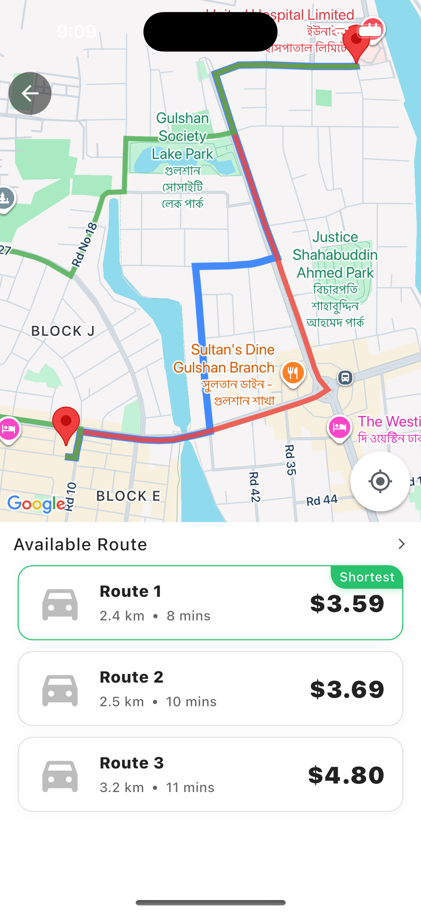

# car_routing_application

# car_routing_application 🚗🗺️

A Flutter project for car routing, navigation, and map-based features.

---

## 📸 Screenshots

  
  
  

---

## 🏗️ Project Folder Architecture
lib/
├─ config/                      # App-wide configuration
│  ├─ api_client/               # API client setup
│  │  ├─ model/                 # API client related models
│  │  │  ├─ api_interceptor.dart
│  │  │  └─ update_api_client.dart
│  ├─ routes/                   # App routing setup
│  │  ├─ app_pages.dart
│  │  └─ app_routes.dart
│  ├─ env.dart                  # Environment variables / setup
│  └─ theme.dart                # Global theme (colors, typography)
│
├─ core/                        # Core modules (shared across features)
│  ├─ constants/                # App-wide constant values
│  ├─ exceptions/               # Custom exceptions
│  ├─ failures/                 # Failure models (error handling)
│  ├─ services/                 # Common services (network, storage, etc.)
│  ├─ utils/                    # Utilities & helpers
│  └─ widget/                   # Shared widgets
│
├─ features/                    # Feature-first structure (Clean Arch layers)
│  ├─ booking/                  # Booking feature
│  │  ├─ data/                  # Data sources, repositories, DTOs
│  │  ├─ domain/                # Entities, repository contracts, use cases
│  │  └─ presentation/          # UI (pages, widgets, controllers)
│  │
│  ├─ home/                     # Home feature
│  │  ├─ data/
│  │  ├─ domain/
│  │  └─ presentation/
│  │
│  └─ splash/                   # Splash/Onboarding feature
│     └─ presentation/
│
└─ main.dart                    # App entry point