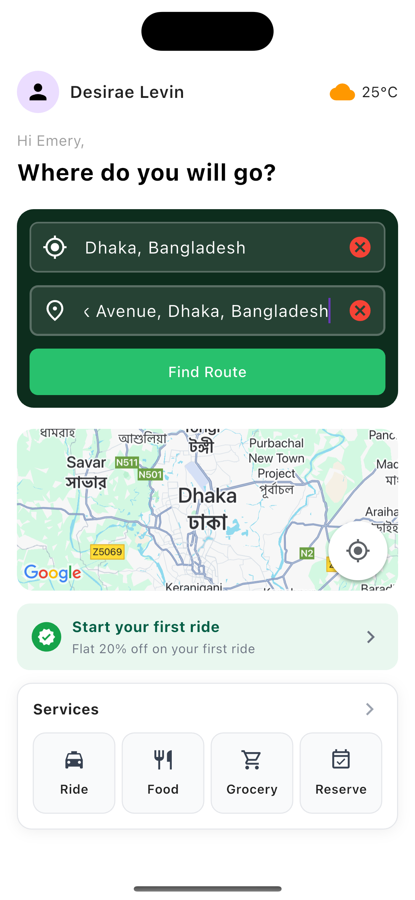

# car_routing_application

# car_routing_application 🚗🗺️

A Flutter project for car routing, navigation, and map-based features.

---

## 📸 Screenshots

  
  
  

(Add your screenshots in the `/screenshots` folder and update paths above.)

---

## 🏗️ Project Folder Architecture
